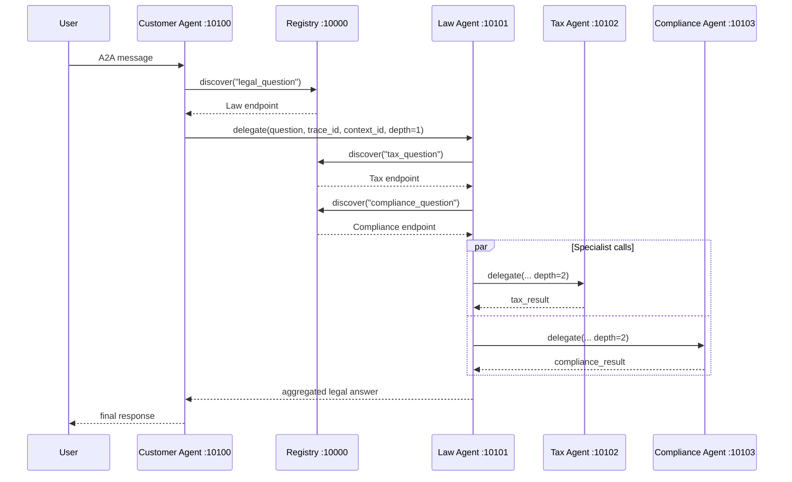

# Stage 5 Trace And Latency Notes

## Trace Flow



Every A2A delegation includes `trace_id`, `context_id`, and `delegation_depth`
inside message metadata. Search the service logs for the same `trace_id` to
follow one request through the system.

## Dynamic Discovery Test

Start all services, then run:

```bash
py scripts/check_dynamic_discovery.py
```

Expected result:

- `legal_question` resolves to Law Agent.
- `tax_question` resolves to Tax Agent.
- `compliance_question` resolves to Compliance Agent.
- `not_a_real_task` returns HTTP 404.

To test failure handling manually, stop Tax Agent, restart Registry and the
remaining agents, then send a tax-related question. Law Agent should return a
final response with tax analysis marked unavailable instead of crashing.

## Latency Baseline And Optimization

Baseline mode:

```bash
FAST_ROUTING=false
py scripts/benchmark_latency.py --runs 3
```

Optimized mode:

```bash
FAST_ROUTING=true
py scripts/benchmark_latency.py --runs 3
```

`FAST_ROUTING=true` skips one Law Agent LLM call used only for routing and
uses deterministic keyword routing instead. The specialist analysis and final
aggregation still use LLM calls, so quality remains comparable while latency
usually drops by the duration of one model request.

Record your actual result here after running with your OpenRouter key:

| Mode | Runs | Min | Avg | Max |
|---|---:|---:|---:|---:|
| Baseline `FAST_ROUTING=false` |  |  |  |  |
| Optimized `FAST_ROUTING=true` |  |  |  |  |

## Optional Auth

Set the same `A2A_API_KEY` value for every service and client to require
`X-A2A-API-Key` on Registry and A2A requests. Leave it empty for the codelab
default.

## Conversation Memory

Customer Agent uses an in-memory LangGraph checkpointer when
`ENABLE_MEMORY=true`. The executor passes `context_id` as `thread_id`, so
messages in the same A2A context can reuse conversation history. Restarting the
Customer Agent clears this memory.

## Retry Logic

`common/a2a_client.py` retries transient A2A delegation failures with
exponential backoff. Tune it with:

```bash
A2A_RETRY_ATTEMPTS=3
A2A_RETRY_INITIAL_DELAY=0.5
```

## Monitoring

Every FastAPI service exposes a Prometheus-style endpoint:

```bash
curl http://localhost:10000/metrics
curl http://localhost:10100/metrics
curl http://localhost:10101/metrics
curl http://localhost:10102/metrics
curl http://localhost:10103/metrics
```

The metrics include total request count and total request duration by service,
method, route, and status code.
